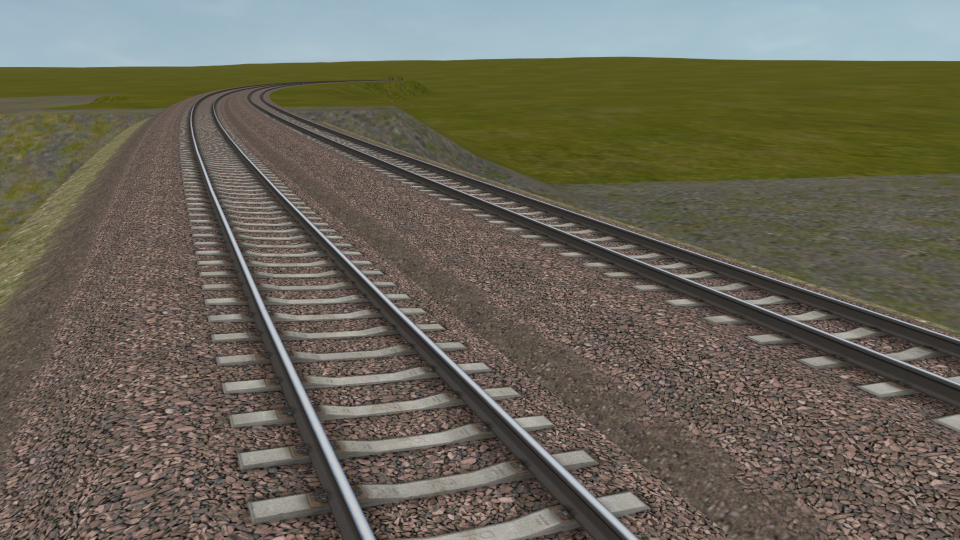
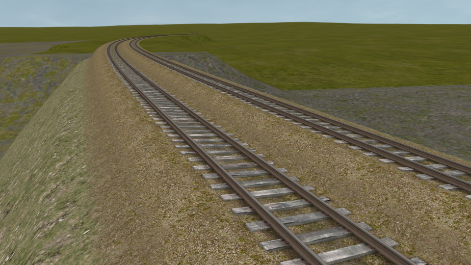

# USTracks STF Profiles
These track profiles allow use of the super-elevation feature in Open Rails together with Norbert Rieger's USTracks. They mimic the original USTracks shapes as best as possible.

If you wish to replace dynamic tracks within a route and/or generate new track shapes, you should instead use the DPP profiles provided by Norbert with Dynatrax.

## Installation
This repository only contains the track profiles. The textures for USTracks can be obtained from the [USTracks package](https://dbtracks.com/pages/DownloadUSTracks.html). You most likely have the textures already if you need these profiles for super-elevation.

**NOTE:** Use of multiple profiles is only supported from testing version _T1.5.1-1390_ or _NYMG rev. 160.2_ onwards.

### Steps to install:
1. Download and extract the [latest release](https://github.com/pgroenbaek/ustracks-stf-profiles/releases).

2. Copy all the track profiles from the `TrackProfiles` folder.

3. Place all of them into the `<route folder>/TrackProfiles` folder.

Open Rails will now automatically generate super-elevated track based on the type of USTracks sections used in the route.

## Usage
The profiles are already configured to match USTracks variant based on the `US` prefixes of the shape file names.

If you have track shapes named anything else, additional match conditions can be added using the `IncludedShapes` parameter within each track profile file. You can also use the `ExcludedShapes` parameter if necessary.

### About Dynatrax generated track sections:
You can make all Dynatrax track shapes use a profile by default by adding `Dynatrax-*` to the `IncludedShapes` parameter within one of the profiles. For example `IncludedShapes ( "US2h_*, Dynatrax-*" )`.

If there are Dynatrax track shapes that you want to use other track variants for, you can then rename the shape file names to include the DBTracks prefix. For example from `Dynatrax-40892.s` to `US3rh_Dynatrax-40892.s`.

As with previous versions of Open Rails you can also copy/paste a profile and rename it `TrProfile.stf` to use it for regular dyntrack.

### Further documentation:
More details on how to use these track profiles is available in the [Open Rails documentation](https://open-rails.readthedocs.io/en/latest/options.html#superelevation). 

More information about the technical aspects of STF track profiles in Open Rails is available in [this document](https://static.openrails.org/files/OpenRails-Testing-How%20to%20Provide%20Track%20Profiles%20for%20Open%20Rails%20Dynamic%20Track.pdf).

## Track Variants

| USTracks package  | Variants to do                                   | Variants done |
|-------------------|--------------------------------------------------|---------------|
| US1               |             | US1, US1b, US1h, US1he           |
| US2              |                | US2, US2b, US2h, US2he          |
| US3              |                               | US3, US3b, US3h, US3he, US3r, US3rb, US3rh, US3rhe              |

If anything is missing, feel free to suggest more by creating an issue.

## Known issues

- There is no good way to place objects at an interval along the generated track with STF profiles. For example the following is missing from super-elevated track:
	- Connectors between the rails in the US3r variants.

Feel free to create an issue if you find more.

## License

These track profiles were configured by Peter Grønbæk Andersen based on Norbert Rieger's original work on USTracks.

The profiles are licensed under [CC BY-NC-SA 4.0](https://creativecommons.org/licenses/by-nc-sa/4.0/).

## Acknowledgements

In memory of Norbert Rieger.

All credit goes to Norbert as he is the author of the original USTracks shapes.

Thanks to [sim-al2](https://www.trainsim.com/forums/member/179636-sim-al2) for pointing out that PositionControl exists and contributing the configuration of it.

## Screenshots

